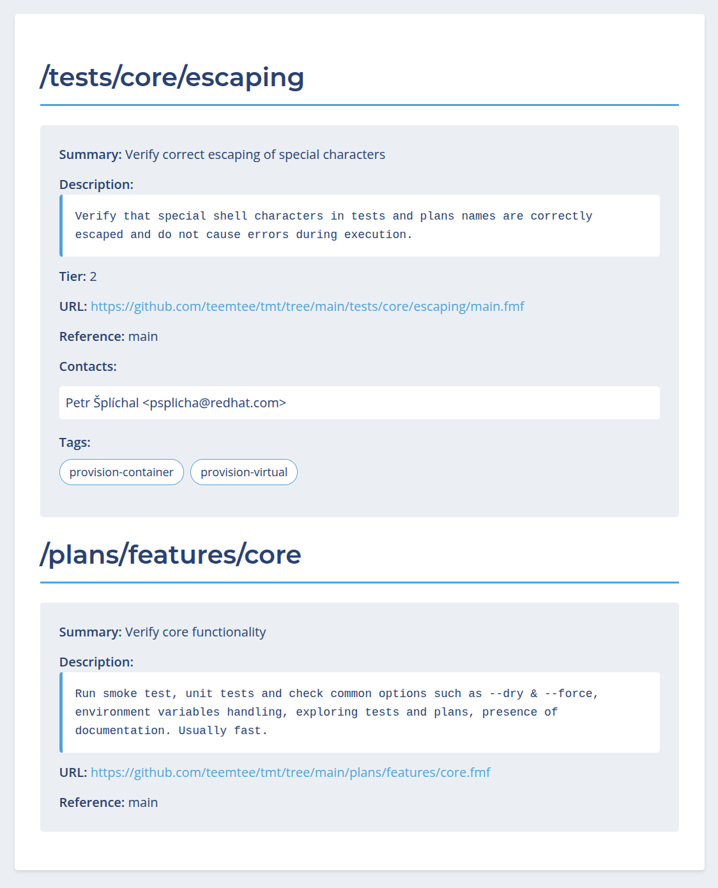
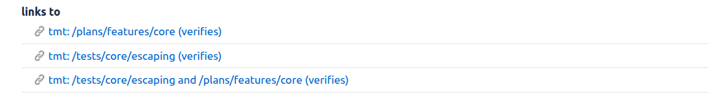

# Improve traceability with the tmt web app

The [tmt web][web] app is a simple web application that makes it
easy to explore and share test and plan metadata without needing
to clone repositories or run tmt commands locally.

At the beginning, there was the following user story:

    As a tester, I need to be able to link the test case(s)
    verifying the issue so that anyone can easily
    find the tests for the verification.

Traceability is an important aspect of the testing process. It is
essential to have a bi-directional link between test coverage and
issues covered by it so that we can easily:

 * identify issues covered by the given test
 * locate tests covering given issues

## Link issue from test

Implementing the first direction in `tmt` was relatively easy:
Just define a standard way to store links with their
relations. This is covered by the core [link][link] key which
holds a list of `relation:link` pairs. Here's an example test
metadata:

```yaml
summary: Verify correct escaping of special characters
test: ./test.sh
link:
  - verifies: https://issues.redhat.com/browse/TT-206
```

## Link test from issue

The solution for the second direction was not that
straightforward. Thanks to its distributed nature, `tmt` does not
have any central place where a Jira issue could point to. There is
no server which keeps information about all tests and stores a
unique id number for each which could be used in the link.

Instead of integers, we're using the [fmf id][fmf id] as the
unique identifier. It contains `url` of the git repository and
`name` of the test. Optionally, it can also define `ref` instead
of using the default branch and `path` to the `fmf` tree if it's
not in the git root.

The `tmt web` app accepts an fmf id of the test or plan or both,
clones the git repository, extracts the metadata, and returns the
data in your preferred format:

 * HTML for human-readable viewing
 * JSON or YAML for programmatic access

The service is currently available at the following location:

 * https://tmt.testing-farm.io/

Here's an example of what the parameters would look like when
requesting information about a test in the default branch of a git
repository:

 * https://tmt.testing-farm.io/?test-url=...&test-name=...

It is possible to link a [test][test], a [plan][plan], or both
[test and plan][both]. The last option can be useful when a single
test is executed under several plans. Here's how the human
readable version looks like:



## Create new tests

In order to make the linking as smooth as possible, the `tmt test
create` command was extended to allow automated linking to Jira
issues.

First make sure you have the `.config/tmt/link.fmf` config
prepared:

```yaml
issue-tracker:
  - type: jira
    url: https://issues.redhat.com
    tmt-web-url: https://tmt.testing-farm.io/
    token: ***
```

When creating a new test, use the `--link` option to provide the
issue which is covered by the test:

```
tmt test create /tests/area/feature --template shell --link verifies:https://issues.redhat.com/browse/TT-206
```

The link will be added to both test metadata and the Jira issue.
Just note that the Jira link will be working once you push the
changes to the remote repository.

## Link existing objects

It's also possible to use the `tmt link` command to link issue
with already existing tests or plans:

```
tmt link --link verifies:https://issues.redhat.com/browse/TT-206 /tests/core/escaping
```

If both test and plan should be linked to the issue, provide both
test and plan as the names:

```
tmt link --link verifies:https://issues.redhat.com/browse/TT-206 /tests/core/escaping /plans/features/core
```

This is how the created links would look like in Jira:



## Closing notes

Currently, as a proof of concept, there is only a single public
instance of the tmt web app deployed so be aware that it can only
explore git repositories which are publicly available. For the
future we consider creating an internal instance in order to be
able to access internal repositories as well.

We are looking for early feedback. If you run into any problems
or any missing features, please let us know by filing a new
[issue][issue]. Thanks!


[link]: https://tmt.readthedocs.io/en/stable/spec/core.html#link
[web]: https://github.com/teemtee/web/
[issue]: https://github.com/teemtee/web/issues/new
[fmf id]: https://fmf.readthedocs.io/en/stable/concept.html#identifiers

[test]: https://tmt.testing-farm.io/?test-url=https%3A%2F%2Fgithub.com%2Fteemtee%2Ftmt.git&test-name=%2Ftests%2Fcore%2Fescaping&test-ref=main
[plan]: https://tmt.testing-farm.io/?plan-url=https%3A%2F%2Fgithub.com%2Fteemtee%2Ftmt.git&plan-name=%2Fplans%2Ffeatures%2Fcore&plan-ref=main
[both]: https://tmt.testing-farm.io/?test-url=https%3A%2F%2Fgithub.com%2Fteemtee%2Ftmt.git&test-name=%2Ftests%2Fcore%2Fescaping&test-ref=main&plan-url=https%3A%2F%2Fgithub.com%2Fteemtee%2Ftmt.git&plan-name=%2Fplans%2Ffeatures%2Fcore&plan-ref=main
